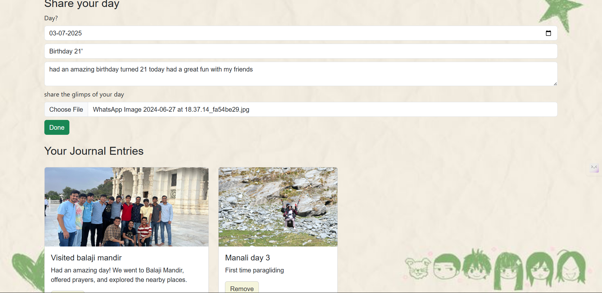

# 📓 Daily Journal Website

A full-stack web application where users can **share daily images**, **write a title**, and **describe their day**.

---

## 🛠️ Tech Stack

- **Frontend:** HTML / CSS / JavaScript / React 
- **Backend:** Spring Boot (Java)
- **File Upload:** Spring Boot Multipart support (for handling image uploads)

---

## ✨ Features

- 📝 Add title and description for each day
- 🖼️ Upload and store daily images
- 📅 View a timeline of past journal entries
- 📂 Images served from Spring Boot backend
- (Optional future) Search, filter, or user authentication

---

